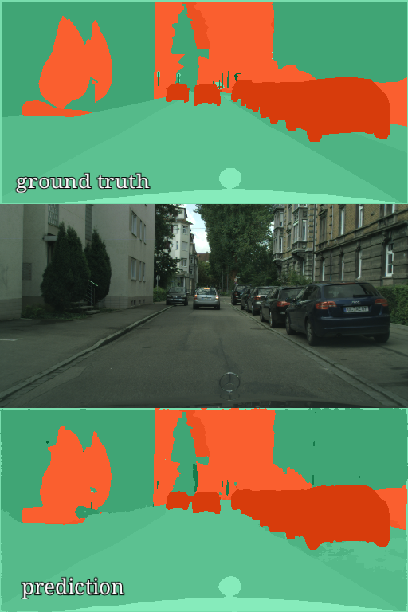
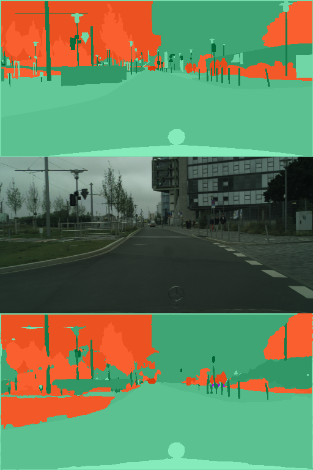

## kerax

*kerax* is small and portable pipeline for image segmentation and classification written in Keras. Main features are simplicity of usage and adding your own data, as well as re-usability of the code and flexibility (several optimizers, loss functions, metrics, custom callbacks for tensorboard and models). Custom models (FC-Densenet, UNet) can be used easily in other projects, as well as custom callbacks for training / validation. Directories `models`, `loaders`, `generators`,`utils` contain README file with brief description.

<p align="left">
  
  
</p>


## Requirements
* Tested with:
    * albumentations==0.3.2
    * Keras==2.2.4
    * keras-tqdm==2.0.1
    * scikit-learn==0.23.1
    * tensorflow-gpu==1.15.0
    * python==3.6.8
* Dockerfile is in `/docker` directory.
* I am going to move to TensorFlow 2.x some time after September 2020.

## How to run

#### Training
```bash
python -m kerax.train \
    --output_dir <path/to/output_dir> \
    --config <path/to/config.py>
```

If you use bazel, then (tested with `bazel 3.4.1`).
```bash
bazel run //:train -- \
    --output_dir <path/to/output_dir> \
    --config <path/to/config.py>
```

#### Prediction
```bash
python -m kerax.predict \
    --output_dir <path/to/output_dir> \
    --config <path/to/config.py> \
    --load_saved_model <path/to/checkpoint.hdf5>
```

```bash
bazel run //:predict -- \
    --output_dir <path/to/output_dir> \
    --config <path/to/config.py> \
    --load_saved_model <path/to/checkpoint.hdf5>
```

## Supported tasks

* Cityscapes segmentation for [Cityscapes dataset](cityscapes-dataset.com).
* Sevestal segmentation for [Severstal defect detection challenge](https://www.kaggle.com/c/severstal-steel-defect-detection). 
* Sevestal classification for [Severstal defect detection challenge](https://www.kaggle.com/c/severstal-steel-defect-detection). 
* Easy to add your own task by adding your custom loader and generator, see README in `/loaders` and `/generators`. It took me 1 hour to add Cityscapes to pipeline and 24 hours to download their dataset.


If you are going to change already written utils or loaders / generators, please run to check if tests are working.
```bash
bazel test --cache_test_results=no //...
```

## Config

Examples of configs are given in `/configs` directory.
Also minimal and maximal (all posible features) configs are providied in `/testdata` directory.

## Project structure

Without bazel-related files, READMEs and unit-test related data. 
```
├── configs
│   ├── cityscapes_segmentation_fcdensenet.py
│   ├── cityscapes_segmentation_unet.py
│   ├── severstal_classification_resnet50.py
│   └── severstal_segmentation_fcdensenet.py
├── docker
│   └── kerax_docker.Dockerfile
├── flags.py
├── generators
│   ├── cityscapes_generator.py
│   ├── generator.py
│   ├── severstal_generator.py
│   └── tests
│       └── <...>
├── loaders
│   ├── cityscapes_data_loader.py
│   ├── data_loader.py
│   ├── severstal_data_loader.py
│   └── tests
│       └── <...>
├── models
│   ├── fc_densenet.py
│   ├── fcd_blocks.py
│   ├── model_hub.py
│   ├── unet.py
|   └── unet_blocks.py
├── predict.py
├── testdata
│   └── <...>
├── train.py
└── utils
    ├── callbacks.py
    ├── general_utils.py
    ├── image_utils.py
    ├── losses.py
    ├── metrics.py
    └── tests
        └── <...>
```

### Todo

- [ ] Move to TensorFlow 2.x Keras
- [ ] Add non-dummy postprocessors for predictions.
- [ ] Add more support for regression tasks.
- [ ] Add automatic hyperparameters search.
- [ ] Fix TODOs left in the code.
