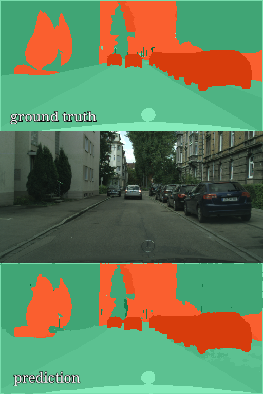
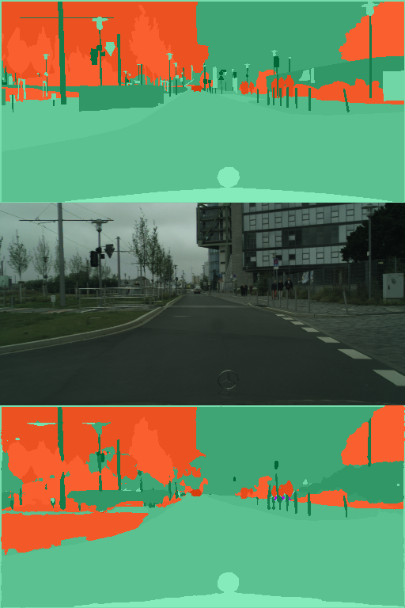

## kerax

*kerax* is small and portable pipeline for image segmentation and classification written in Keras. Main features are simplicity of usage and adding your own data, as well as re-usability of the code and flexibility (several optimizers, loss functions, metrics, custom callbacks for tensorboard and models). Custom models (FC-Densenet, UNet) can be used easily in other projects, as well as custom callbacks for training / validation. Directories `kerax`, and further `models`, `loaders`, `generators`,`utils` contain README file with brief description.

  
  

## Requirements
* Tested with:
    * albumentations==0.3.2
    * Keras==2.2.4
    * keras-tqdm==2.0.1
    * scikit-learn==0.23.1
    * tensorflow-gpu==1.15.0
    * python==3.6.8
* Dockerfile is in `/docker` directory.
* I am going to move to TensorFlow 2.x some time after September 2020.

### Todo

- [ ] Move to TensorFlow 2.x Keras
- [ ] Add non-dummy postprocessors for predictions.
- [ ] Add more support for regression tasks.
- [ ] Add automatic hyperparameters search.
- [ ] Fix TODOs left in the code.